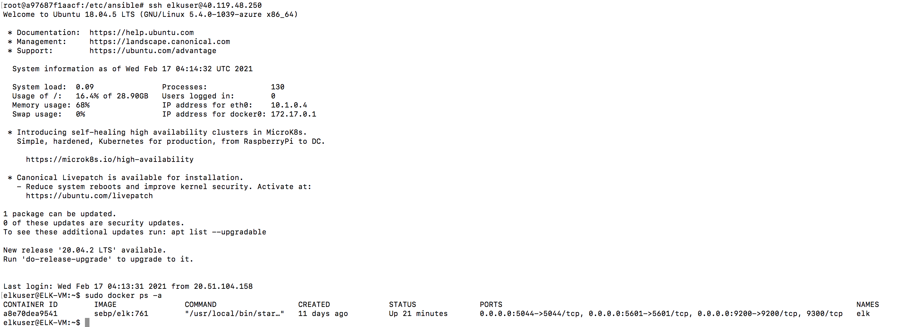
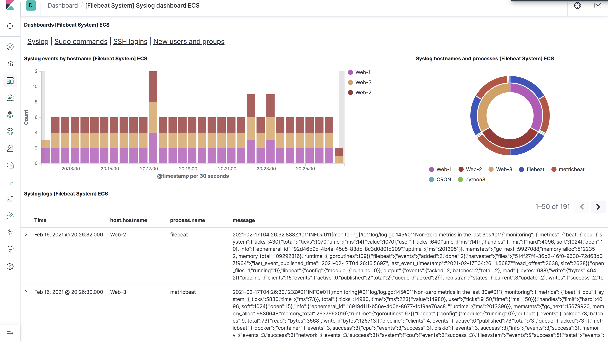
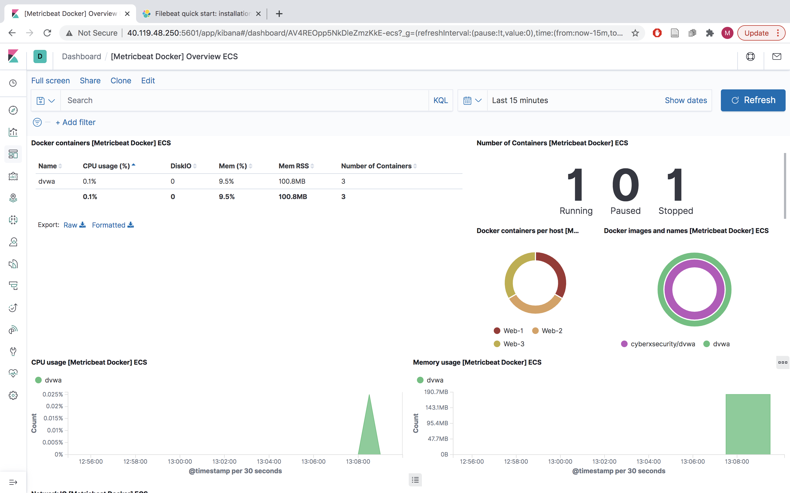

## Automated ELK Stack Deployment

The files in this repository were used to configure the network depicted below.

**Note**: ELK Stack Server Diagram

.png)

These files have been tested and used to generate a live ELK deployment on Azure. They can be used to either recreate the entire deployment pictured above. Alternatively, select portions of the Images file may be used to install only certain pieces of it, such as Filebeat, Metricbeat, Docker, Apache.

- [Filebeat](Images/filebeat_playbook.png)
- [Metricbeat](Images/metricbeat_playbook.png)
- [Apache](Images/apacheinstall_playbook.png)
- [Docker](Images/dockerinstall_playbook.png)

This document contains the following details:
- Description of the Topologu
- Access Policies
- ELK Configuration
  - Beats in Use
  - Machines Being Monitored
- How to Use the Ansible Build

### Description of the Topology

The main purpose of this network is to expose a load-balanced and monitored instance of DVWA, the D*mn Vulnerable Web Application.

Load balancing ensures that the application will be highly reliable, in addition to restricting access to the network.
- Load Balancers protect against DoS attacks. The advantage of the jump box is that it restricts access to one administrator. Integrating an ELK server allows users to easily monitor the vulnerable VMs for changes to the actual machines and system logs.

Integrating an ELK server allows users to easily monitor the vulnerable VMs for changes to the logs and system traffic.
-  Filebeat is a logging agent installed on the machine generating the log files, tailing them, and forwarding the data to either Logstash for more advanced processing or directly into Elasticsearch for indexing. Specifically, it logs information about the file system, including which files have changed and when.
- Metricbeat is a lightweight shipper that you can install on your servers to periodically collect metrics from the operating system and from services running on the server. Metricbeat takes the metrics and statistics that it collects and ships them to the output that you specify, such as Elasticsearch or Logstash.

The configuration details of each machine may be found below.

|         Name        | Function         | IP Address    | Operating System |
|:-------------------:|------------------|---------------|------------------|
| Jumpbox-Provisioner |      Gateway     | 20.51.104.158 |       Linux      |
|        Web-1        |  DVWA Container  |   10.0.0.10   |       Linux      |
|        Web-2        |  DVWA Container  |   10.0.0.11   |       Linux      |
|        Web-3        |  DVWA Container  |   10.0.0.12   |       Linux      |
|        ELK-VM       | Configuration VM |    10.1.0.4   |       Linux      |

### Access Policies

The machines on the internal network are not exposed to the public Internet. 

Only the Jump Box (provisioner) machine can accept connections from the Internet. Access to this machine is only allowed from the following IP addresses:
- Whitelisted IP Addresses:
- 76.172.68.15 (personal Public IP address)

Machines within the network can only be accessed by accessing the DVWA containers in the *Jumpbox-Provisioner* Virutal Machine.
- The only machines that can access the ELK server are personal machine (Public IP-76.172.68.15) and the Jumpbox-Provisioner VM (Public IP-20.51.104.158) through a peering connection

A summary of the access policies in place can be found in the table below.

|         Name        | Publicly Accessible |         Allowed IPs         |
|:-------------------:|:-------------------:|:---------------------------:|
| Jumpbox-Provisioner |         yes         | 20.51.104.158, 76.172.68.15 |
|        Web-1        |          no         |        20.51.104.158        |
|        Web-2        |          no         |        20.51.104.158        |
|        Web-3        |          no         |        20.51.104.158        |
|        ELK-VM       |          no         | 20.51.104.158, 76.172.68.15 |

### Elk Configuration

Ansible was used to automate configuration of the ELK machine. No configuration was performed manually, which is advantageous because...
- servcies running can be limited, system installation and update can be streamlined, and processes become more replicable.

The playbook implements the following tasks:
- Install Docker
- Download Image
- Configure container
- Create playbook to install container with docker and Filebeat and Metricbeat.
- Run playbook to launch the container

The following screenshot displays the result of running `docker ps` after successfully configuring the ELK instance. 

### Target Machines & Beats
This ELK server is configured to monitor the following machines:
- Web-1 (Private IP: 10.0.0.10)
- Web-2 (Private IP: 10.0.0.11)
- Web-3 (Private IP: 10.0.0.12)

We have installed the following Beats on these machines:
- Filebeat
- Metricbeat

These Beats allow us to collect the following information from each machine:
- Filebeat monitors the log files or locations that you specify, collects log events, and forwards them either to Elasticsearch or Logstash for indexing. When Filebeat starts logging, it will represent data such as system log events in a dashboard:

- Metricbeat periodically collect metrics from the operating system and from services running on the server. Metricbeat takes the metrics and statistics that it collects and ships them to the output that you specify, such as Elasticsearch or Logstash. Metricbeat will display information such as container CPU usage as follows:

### Using the Playbook
In order to use the playbook, you will need to have an Ansible control node already configured. Assuming you have such a control node provisioned: 

SSH into the control node and follow the steps below:

- Go to /etc/ansible/files and use the curl command to add the config file:
'''
curlhttps://gist.githubusercontent.com/slape/5cc350109583af6cbe577bbcc0710c93/raw/eca603b72586fbe148c11f9c87bf96a63cb25760/Filebeat > /etc/ansible/files/filebeat-config.yml
'''
- Copy the filebeat-playbook.yml file to /etc/ansible/roles.
- Update the filebeat-config.yml file to include the ELK server private IP in lines 1106 and 1806.
- Run the filebeat-playbook.yml playbook, and navigate to the kibana page at [ELK public IP]/app/kibana to check that the installation worked as expected.

